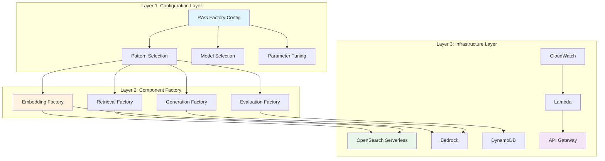

# 🏭 AI RAG Factory - NVIDIA-Style Architecture on AWS

## Overview

Build a modular, production-grade RAG factory that lets you **configure, deploy, and scale any RAG pattern** with parameter changes - inspired by NVIDIA's AI Blueprint approach but using AWS services.

---

## 🎯 What is a RAG Factory?

**NVIDIA's Approach:**
- Pre-built, configurable RAG pipelines
- Containerized microservices (NIM)
- GPU-optimized inference
- Enterprise-ready deployment

**Our AWS Approach:**
- 37 pre-built RAG patterns
- Serverless, auto-scaling
- Pay-per-use (no GPU management)
- AWS-native integration

---

## 🏗️ Architecture: 3-Layer Factory



---

## 📋 Layer 1: Configuration Layer

### RAG Factory Configuration File

```yaml
# rag_factory_config.yaml
factory_name: "my_rag_application"
version: "1.0"

# Pattern Selection (from our 37 patterns)
pattern:
  primary: "adaptive_rag"           # Main pattern
  fallback: "simple_rag"            # Fallback on failure
  enhancements:                     # Stack patterns
    - "reranking"                   # Add reranking
    - "caching"                     # Add caching
    - "streaming"                   # Stream responses

# Model Configuration
models:
  embedding:
    provider: "bedrock"
    model_id: "amazon.titan-embed-text-v2:0"
    dimension: 1024
    
  generation:
    provider: "bedrock"
    routing:                        # Adaptive routing
      simple:
        model_id: "us.anthropic.claude-haiku-3-5"
        max_tokens: 1024
        temperature: 0.7
      
      complex:
        model_id: "us.anthropic.claude-sonnet-4-6"
        max_tokens: 2048
        temperature: 0.7
      
      critical:
        model_id: "us.anthropic.claude-opus-4-8"
        max_tokens: 4096
        temperature: 0.3

# Retrieval Configuration
retrieval:
  vector_store: "opensearch_serverless"
  index_name: "my_documents"
  top_k: 5
  similarity_threshold: 0.7
  
  # Multi-stage retrieval
  stages:
    - type: "vector_search"
      top_k: 20
    
    - type: "rerank"
      model: "cross_encoder"
      top_k: 5
    
    - type: "compression"
      method: "contextual"
      reduction: 0.5

# Performance Configuration
performance:
  caching:
    enabled: true
    provider: "elasticache"
    ttl: 3600
    cache_embeddings: true
    cache_results: true
  
  streaming:
    enabled: true
    chunk_size: 20  # tokens
  
  timeout:
    retrieval: 2000  # ms
    generation: 10000  # ms

# Quality & Safety
quality:
  self_correction:
    enabled: true
    confidence_threshold: 0.8
    max_iterations: 2
  
  hallucination_detection:
    enabled: true
    require_citations: true
  
  content_filtering:
    enabled: true
    pii_detection: true

# Monitoring
monitoring:
  cloudwatch:
    enabled: true
    metrics:
      - latency
      - cost
      - quality_score
      - cache_hit_rate
  
  alerting:
    - metric: "latency_p95"
      threshold: 3000
      action: "sns_alert"
    
    - metric: "error_rate"
      threshold: 0.05
      action: "pagerduty"

# Cost Controls
cost_controls:
  budget:
    daily: 100  # USD
    monthly: 2000
  
  auto_scaling:
    enabled: true
    min_capacity: 2
    max_capacity: 100
    target_utilization: 0.7
```

---

## 🏭 Layer 2: Component Factory

### 1. Embedding Factory

```python
# embedding_factory.py

class EmbeddingFactory:
    """Factory for embedding models"""
    
    MODELS = {
        'titan-v2': {
            'model_id': 'amazon.titan-embed-text-v2:0',
            'dimension': 1024,
            'cost_per_1k': 0.0001
        },
        'titan-multimodal': {
            'model_id': 'amazon.titan-embed-image-v1',
            'dimension': 1024,
            'cost_per_1k': 0.0002
        },
        'cohere-v3': {
            'model_id': 'cohere.embed-english-v3',
            'dimension': 1024,
            'cost_per_1k': 0.0001
        }
    }
    
    @classmethod
    def create(cls, config: Dict) -> BaseEmbedding:
        """Create embedding model from config"""
        model_name = config['model']
        model_config = cls.MODELS[model_name]
        
        if config.get('caching', {}).get('enabled'):
            return CachedEmbedding(
                model_id=model_config['model_id'],
                cache_backend='elasticache'
            )
        
        return BedrockEmbedding(
            model_id=model_config['model_id']
        )
```

### 2. Retrieval Factory

```python
# retrieval_factory.py

class RetrievalFactory:
    """Factory for retrieval strategies"""
    
    STRATEGIES = {
        'simple': SimpleRetrieval,
        'hybrid': HybridRetrieval,
        'fusion': FusionRetrieval,
        'hierarchical': HierarchicalRetrieval,
    }
    
    @classmethod
    def create_pipeline(cls, config: Dict) -> RetrievalPipeline:
        """Create multi-stage retrieval pipeline"""
        stages = []
        
        for stage_config in config['stages']:
            stage_type = stage_config['type']
            
            if stage_type == 'vector_search':
                stages.append(VectorSearchStage(
                    top_k=stage_config['top_k']
                ))
            
            elif stage_type == 'rerank':
                stages.append(RerankStage(
                    model=stage_config['model'],
                    top_k=stage_config['top_k']
                ))
            
            elif stage_type == 'compression':
                stages.append(CompressionStage(
                    method=stage_config['method'],
                    reduction=stage_config['reduction']
                ))
        
        return RetrievalPipeline(stages=stages)
```

### 3. Generation Factory

```python
# generation_factory.py

class GenerationFactory:
    """Factory for generation with adaptive routing"""
    
    @classmethod
    def create_router(cls, config: Dict) -> AdaptiveRouter:
        """Create adaptive router for model selection"""
        
        routes = {}
        for complexity, model_config in config['routing'].items():
            routes[complexity] = BedrockLLM(
                model_id=model_config['model_id'],
                max_tokens=model_config['max_tokens'],
                temperature=model_config['temperature']
            )
        
        return AdaptiveRouter(
            routes=routes,
            classifier=ComplexityClassifier()
        )
```

### 4. Pattern Factory

```python
# pattern_factory.py

class PatternFactory:
    """Factory for RAG patterns"""
    
    PATTERNS = {
        'simple_rag': SimpleRAG,
        'adaptive_rag': AdaptiveRAG,
        'corrective_rag': CorrectiveRAG,
        'self_rag': SelfRAG,
        'agentic_rag': AgenticRAG,
        'memory_augmented': MemoryAugmentedRAG,
        'ensemble_rag': EnsembleRAG,
        'hierarchical_rag': HierarchicalRAG,
        # ... all 37 patterns
    }
    
    @classmethod
    def create(cls, config: Dict) -> BaseRAGPattern:
        """Create RAG pattern from config"""
        pattern_name = config['pattern']['primary']
        pattern_class = cls.PATTERNS[pattern_name]
        
        # Create base pattern
        pattern = pattern_class(
            embedder=EmbeddingFactory.create(config['models']['embedding']),
            retriever=RetrievalFactory.create_pipeline(config['retrieval']),
            generator=GenerationFactory.create_router(config['models']['generation'])
        )
        
        # Add enhancements
        for enhancement in config['pattern'].get('enhancements', []):
            pattern = cls._add_enhancement(pattern, enhancement, config)
        
        return pattern
    
    @classmethod
    def _add_enhancement(cls, pattern, enhancement, config):
        """Wrap pattern with enhancement"""
        if enhancement == 'reranking':
            return RerankingWrapper(pattern)
        
        elif enhancement == 'caching':
            return CachingWrapper(
                pattern,
                cache_backend='elasticache',
                ttl=config['performance']['caching']['ttl']
            )
        
        elif enhancement == 'streaming':
            return StreamingWrapper(pattern)
        
        return pattern
```

---

## 🔧 Layer 3: Infrastructure as Code

### Terraform Configuration

```hcl
# rag_factory.tf

# OpenSearch Serverless Collection
resource "aws_opensearchserverless_collection" "rag_factory" {
  name = var.factory_name
  type = "VECTORSEARCH"
  
  tags = {
    Environment = var.environment
    ManagedBy   = "rag-factory"
  }
}

# Lambda Function for RAG API
resource "aws_lambda_function" "rag_api" {
  function_name = "${var.factory_name}-api"
  role          = aws_iam_role.rag_lambda.arn
  
  runtime       = "python3.12"
  handler       = "handler.lambda_handler"
  timeout       = 30
  memory_size   = 2048
  
  environment {
    variables = {
      CONFIG_PATH = var.config_path
      OPENSEARCH_ENDPOINT = aws_opensearchserverless_collection.rag_factory.endpoint
    }
  }
  
  # Provisioned concurrency for low latency
  dynamic "provisioned_concurrency_config" {
    for_each = var.enable_provisioned ? [1] : []
    content {
      provisioned_concurrent_executions = var.provisioned_concurrency
    }
  }
}

# API Gateway
resource "aws_apigatewayv2_api" "rag_factory" {
  name          = "${var.factory_name}-api"
  protocol_type = "HTTP"
  
  cors_configuration {
    allow_origins = var.allowed_origins
    allow_methods = ["POST", "OPTIONS"]
    allow_headers = ["content-type", "authorization"]
  }
}

# DynamoDB for Memory/Caching
resource "aws_dynamodb_table" "rag_memory" {
  name           = "${var.factory_name}-memory"
  billing_mode   = "PAY_PER_REQUEST"
  hash_key       = "session_id"
  range_key      = "timestamp"
  
  attribute {
    name = "session_id"
    type = "S"
  }
  
  attribute {
    name = "timestamp"
    type = "N"
  }
  
  ttl {
    attribute_name = "ttl"
    enabled        = true
  }
}

# CloudWatch Dashboard
resource "aws_cloudwatch_dashboard" "rag_factory" {
  dashboard_name = "${var.factory_name}-metrics"
  
  dashboard_body = jsonencode({
    widgets = [
      {
        type = "metric"
        properties = {
          title = "Latency (p95)"
          metrics = [
            ["${var.factory_name}", "Latency", { stat = "p95" }]
          ]
        }
      },
      {
        type = "metric"
        properties = {
          title = "Cost per Query"
          metrics = [
            ["${var.factory_name}", "CostPerQuery"]
          ]
        }
      },
      {
        type = "metric"
        properties = {
          title = "Quality Score"
          metrics = [
            ["${var.factory_name}", "QualityScore"]
          ]
        }
      }
    ]
  })
}

# Auto Scaling
resource "aws_appautoscaling_target" "rag_lambda" {
  count              = var.enable_auto_scaling ? 1 : 0
  max_capacity       = var.max_capacity
  min_capacity       = var.min_capacity
  resource_id        = "function:${aws_lambda_function.rag_api.function_name}"
  scalable_dimension = "lambda:function:ProvisionedConcurrentExecutions"
  service_namespace  = "lambda"
}

resource "aws_appautoscaling_policy" "rag_scaling" {
  count              = var.enable_auto_scaling ? 1 : 0
  name               = "${var.factory_name}-scaling"
  policy_type        = "TargetTrackingScaling"
  resource_id        = aws_appautoscaling_target.rag_lambda[0].resource_id
  scalable_dimension = aws_appautoscaling_target.rag_lambda[0].scalable_dimension
  service_namespace  = aws_appautoscaling_target.rag_lambda[0].service_namespace
  
  target_tracking_scaling_policy_configuration {
    predefined_metric_specification {
      predefined_metric_type = "LambdaProvisionedConcurrencyUtilization"
    }
    target_value = var.target_utilization
  }
}
```

---

## 🚀 Deployment Modes

### Mode 1: Development (Single Pattern)

```bash
# Quick start for testing
rag-factory deploy \
  --pattern simple_rag \
  --model claude-haiku \
  --mode dev
  
# Cost: ~$0.08/query
# Latency: ~1-2s
# Scale: 1-10 queries/sec
```

### Mode 2: Production (Adaptive Multi-Pattern)

```bash
# Full production deployment
rag-factory deploy \
  --config production_config.yaml \
  --environment prod \
  --enable-monitoring \
  --enable-auto-scaling
  
# Cost: ~$0.05-0.20/query (adaptive)
# Latency: ~500ms-2s
# Scale: 100+ queries/sec
```

### Mode 3: Enterprise (Multi-Tenant)

```bash
# Multi-tenant with isolation
rag-factory deploy \
  --config enterprise_config.yaml \
  --multi-tenant \
  --enable-rbac \
  --enable-audit-logging
  
# Cost: Variable by tenant
# Latency: <1s
# Scale: 1000+ queries/sec
```

---

## 📊 Factory Control Plane

### Web UI Dashboard

```python
# factory_dashboard.py (Streamlit)

import streamlit as st
from rag_factory import RAGFactory

st.title("🏭 AI RAG Factory Control Plane")

# Pattern Selection
pattern = st.selectbox(
    "Select RAG Pattern",
    options=RAGFactory.list_patterns(),
    help="Choose from 37 pre-built patterns"
)

# Model Configuration
col1, col2 = st.columns(2)
with col1:
    embedding_model = st.selectbox(
        "Embedding Model",
        ["Titan V2", "Titan Multimodal", "Cohere V3"]
    )

with col2:
    generation_model = st.selectbox(
        "Generation Model",
        ["Claude Haiku (Fast/Cheap)", 
         "Claude Sonnet (Balanced)", 
         "Claude Opus (Quality)"]
    )

# Quality Controls
st.subheader("Quality & Safety")
enable_self_correction = st.checkbox("Self-Correction", value=True)
enable_citations = st.checkbox("Require Citations", value=True)
enable_pii_detection = st.checkbox("PII Detection", value=True)

# Performance Tuning
st.subheader("Performance")
enable_caching = st.checkbox("Enable Caching", value=True)
enable_streaming = st.checkbox("Enable Streaming", value=True)

# Deploy
if st.button("Deploy RAG Application"):
    config = RAGFactory.build_config(
        pattern=pattern,
        embedding_model=embedding_model,
        generation_model=generation_model,
        quality_controls={
            'self_correction': enable_self_correction,
            'citations': enable_citations,
            'pii_detection': enable_pii_detection
        },
        performance={
            'caching': enable_caching,
            'streaming': enable_streaming
        }
    )
    
    factory = RAGFactory(config)
    endpoint = factory.deploy()
    
    st.success(f"Deployed! Endpoint: {endpoint}")
    st.code(f"curl -X POST {endpoint}/query -d '{{\"query\": \"your question\"}}'")

# Monitoring
st.subheader("Live Metrics")
metrics = RAGFactory.get_metrics()

col1, col2, col3, col4 = st.columns(4)
col1.metric("Queries/min", metrics['qpm'])
col2.metric("P95 Latency", f"{metrics['p95_latency']}ms")
col3.metric("Cost/Query", f"${metrics['cost_per_query']:.4f}")
col4.metric("Quality Score", f"{metrics['quality_score']:.2f}")

# Cost Tracking
st.subheader("Cost Tracking")
st.line_chart(metrics['cost_over_time'])
```

---

## 🔄 Factory API

### REST API Endpoints

```python
# API endpoints for RAG Factory

# 1. Query Endpoint
POST /v1/query
{
  "query": "What is the pricing for AWS Bedrock?",
  "session_id": "optional-session-id",
  "options": {
    "pattern": "adaptive_rag",
    "streaming": true,
    "max_tokens": 2048
  }
}

# 2. Pattern List Endpoint
GET /v1/patterns
Response: {
  "patterns": [
    {"id": "simple_rag", "complexity": "simple", "cost_per_query": 0.08},
    {"id": "adaptive_rag", "complexity": "medium", "cost_per_query": 0.12},
    ...
  ]
}

# 3. Deploy Configuration Endpoint
POST /v1/deploy
{
  "config": {...},  # YAML config as JSON
  "environment": "dev|prod",
  "dry_run": false
}

# 4. Metrics Endpoint
GET /v1/metrics
Response: {
  "qpm": 45,
  "p95_latency": 850,
  "cost_per_query": 0.12,
  "quality_score": 0.87
}

# 5. Health Endpoint
GET /v1/health
Response: {
  "status": "healthy",
  "opensearch": "connected",
  "bedrock": "available"
}
```

---

## 💡 Key Innovations vs NVIDIA

| Aspect | NVIDIA Approach | Our AWS Approach |
|--------|----------------|------------------|
| **Infrastructure** | GPU instances (NIM) | Serverless (Lambda + Bedrock) |
| **Scaling** | Kubernetes pods | Auto-scaling (AWS) |
| **Cost Model** | GPU time | Pay-per-use |
| **Deployment** | Container registry | Infrastructure as Code |
| **Models** | Self-hosted | Managed (Bedrock) |
| **Orchestration** | Helm charts | Terraform + CDK |

### Our Advantages

1. **Zero Infrastructure Management**
   - No GPUs to provision
   - No containers to manage
   - Auto-scaling built-in

2. **Cost Efficiency**
   - Pay only for queries
   - No idle GPU costs
   - Aggressive caching

3. **Enterprise Integration**
   - Native AWS IAM
   - VPC isolation
   - Compliance (SOC2, HIPAA)

4. **Rapid Development**
   - 37 pre-built patterns
   - Config-driven deployment
   - Minutes to production

---

## 🧪 Example: Deploy Custom RAG Factory

### Step 1: Create Config

```yaml
# my_rag_factory.yaml
factory_name: "customer_support_rag"
version: "1.0"

pattern:
  primary: "memory_augmented"  # Conversational
  enhancements:
    - "streaming"              # Fast responses
    - "caching"                # Cost savings
    - "reranking"              # Quality

models:
  embedding:
    model_id: "amazon.titan-embed-text-v2:0"
  
  generation:
    routing:
      simple:
        model_id: "us.anthropic.claude-haiku-3-5"
      complex:
        model_id: "us.anthropic.claude-sonnet-4-6"

retrieval:
  top_k: 5
  stages:
    - type: "vector_search"
      top_k: 20
    - type: "rerank"
      top_k: 5

performance:
  caching:
    enabled: true
    ttl: 3600
  streaming:
    enabled: true

quality:
  self_correction:
    enabled: true
  require_citations: true
```

### Step 2: Deploy with CLI

```bash
# Install CLI
pip install rag-factory-aws

# Initialize
rag-factory init \
  --region us-west-2 \
  --profile my-aws-profile

# Deploy
rag-factory deploy \
  --config my_rag_factory.yaml \
  --environment prod

# Output:
# ✓ Created OpenSearch collection
# ✓ Deployed Lambda function
# ✓ Created API Gateway endpoint
# ✓ Set up CloudWatch dashboard
#
# Endpoint: https://abc123.execute-api.us-west-2.amazonaws.com/prod
# Dashboard: https://console.aws.amazon.com/cloudwatch/...
```

### Step 3: Use API

```python
import requests

endpoint = "https://abc123.execute-api.us-west-2.amazonaws.com/prod"

# Query
response = requests.post(
    f"{endpoint}/v1/query",
    json={
        "query": "How do I reset my password?",
        "session_id": "user_123"
    }
)

result = response.json()
print(result['answer'])

# Metrics
metrics = requests.get(f"{endpoint}/v1/metrics").json()
print(f"P95 Latency: {metrics['p95_latency']}ms")
print(f"Cost/Query: ${metrics['cost_per_query']}")
```

---

## 📦 Core Components to Build

### 1. **rag_factory/** (Python Package)

```
rag_factory/
├── __init__.py
├── cli/
│   ├── deploy.py
│   ├── test.py
│   └── monitor.py
├── core/
│   ├── pattern_factory.py
│   ├── embedding_factory.py
│   ├── retrieval_factory.py
│   └── generation_factory.py
├── patterns/
│   ├── simple_rag.py
│   ├── adaptive_rag.py
│   ├── corrective_rag.py
│   └── ... (all 37 patterns)
├── infrastructure/
│   ├── terraform/
│   │   ├── opensearch.tf
│   │   ├── lambda.tf
│   │   └── api_gateway.tf
│   └── cdk/
│       └── rag_factory_stack.py
└── monitoring/
    ├── metrics.py
    ├── alerting.py
    └── dashboard.py
```

### 2. **Infrastructure Templates**

```
terraform/
├── modules/
│   ├── opensearch_serverless/
│   ├── bedrock_integration/
│   ├── lambda_rag_api/
│   └── monitoring/
├── environments/
│   ├── dev.tfvars
│   ├── staging.tfvars
│   └── prod.tfvars
└── main.tf
```

### 3. **Web Dashboard**

```
dashboard/
├── src/
│   ├── pages/
│   │   ├── Deploy.tsx
│   │   ├── Monitor.tsx
│   │   ├── Test.tsx
│   │   └── Patterns.tsx
│   ├── components/
│   │   ├── PatternSelector.tsx
│   │   ├── ModelConfig.tsx
│   │   └── MetricsChart.tsx
│   └── api/
│       └── factory_client.ts
└── package.json
```

---

## 🎯 Implementation Roadmap

### Phase 1: Core Factory (Week 1-2)

**Goal**: Basic factory that can deploy any of our 37 patterns

1. **Pattern Registry**
   - Load all 37 patterns into factory
   - Pattern metadata (cost, latency, complexity)
   - Pattern compatibility matrix

2. **Configuration Engine**
   - YAML → Python config objects
   - Validation and defaults
   - Override mechanism

3. **Component Factories**
   - Embedding factory
   - Retrieval factory
   - Generation factory
   - Pattern assembly

4. **Basic CLI**
   ```bash
   rag-factory init
   rag-factory deploy --config config.yaml
   rag-factory test --query "test query"
   ```

**Deliverables**:
- ✅ Python package installable via pip
- ✅ Deploy to Lambda + API Gateway
- ✅ Query any pattern via API
- ✅ Cost: ~$50 infrastructure/month

### Phase 2: Infrastructure as Code (Week 3)

**Goal**: One-click infrastructure deployment

1. **Terraform Modules**
   - OpenSearch Serverless
   - Lambda + API Gateway
   - DynamoDB for memory
   - CloudWatch dashboards

2. **Multi-Environment**
   - Dev, staging, prod configs
   - Separate AWS accounts
   - State management (S3 backend)

3. **Auto-Scaling**
   - Lambda concurrency
   - OpenSearch capacity
   - Cost controls

**Deliverables**:
- ✅ `terraform apply` → full stack
- ✅ Environment isolation
- ✅ Auto-scaling configured

### Phase 3: Monitoring & Observability (Week 4)

**Goal**: Production-grade monitoring

1. **Metrics Collection**
   - Latency (p50, p95, p99)
   - Cost per query
   - Quality scores
   - Error rates

2. **CloudWatch Integration**
   - Custom metrics
   - Log insights
   - Alarms

3. **Dashboards**
   - Real-time metrics
   - Cost tracking
   - Quality trends

**Deliverables**:
- ✅ CloudWatch dashboard
- ✅ Alert system
- ✅ Cost breakdown

### Phase 4: Web UI (Week 5-6)

**Goal**: No-code RAG deployment

1. **Pattern Selector**
   - Browse 37 patterns
   - Compare features
   - Cost calculator

2. **Configuration Builder**
   - Visual config editor
   - Model selection
   - Performance tuning

3. **Testing Interface**
   - Query testing
   - Comparison mode
   - Quality evaluation

4. **Deployment**
   - One-click deploy
   - Environment management
   - Rollback support

**Deliverables**:
- ✅ React web dashboard
- ✅ Streamlit alternative
- ✅ API integration

### Phase 5: Advanced Features (Week 7-8)

**Goal**: Enterprise capabilities

1. **Multi-Tenancy**
   - Tenant isolation
   - Resource quotas
   - Billing per tenant

2. **A/B Testing**
   - Traffic splitting
   - Pattern comparison
   - Statistical significance

3. **Fine-Tuning Integration**
   - Connect to SageMaker
   - Custom embeddings
   - Domain adaptation

4. **Evaluation Framework**
   - Ground truth datasets
   - Automated testing
   - Regression detection

**Deliverables**:
- ✅ Multi-tenant support
- ✅ A/B testing framework
- ✅ Evaluation suite

---

## 💰 Cost Estimates

### Infrastructure Costs (Monthly)

| Component | Dev | Prod | Enterprise |
|-----------|-----|------|-----------|
| OpenSearch Serverless | $50 | $200 | $800 |
| Lambda (provisioned) | $0 | $100 | $500 |
| API Gateway | $5 | $30 | $150 |
| DynamoDB | $5 | $20 | $100 |
| CloudWatch | $10 | $50 | $200 |
| **Total** | **$70** | **$400** | **$1,750** |

### Query Costs (per 1000 queries)

| Pattern | Embedding | Generation | Total |
|---------|-----------|----------|-------|
| Simple RAG | $0.02 | $0.80 | $0.82 |
| Adaptive RAG | $0.02 | $0.40-1.20 | $0.42-1.22 |
| Self RAG | $0.02 | $1.80 | $1.82 |
| Ensemble RAG | $0.04 | $2.00 | $2.04 |

**Optimization**: Caching reduces costs by 70-90%

---

## 🚦 Quick Start Guide

### For Developers

```bash
# 1. Install
pip install rag-factory-aws

# 2. Configure AWS
aws configure

# 3. Initialize
rag-factory init --region us-west-2

# 4. Create config
cat > my_config.yaml <<EOF
factory_name: "my_rag_app"
pattern:
  primary: "adaptive_rag"
  enhancements: ["caching", "streaming"]
