# 📊 RAG Patterns - Visual Architecture Guide

**Complete visual reference for all 37 RAG patterns with Mermaid diagrams**

---

## 📑 Table of Contents

1. [Basic RAG Flow](#1-basic-rag-flow)
2. [Simple RAG (#1)](#2-simple-rag-1)
3. [Graph RAG (#2)](#3-graph-rag-2)
4. [Agentic RAG (#12)](#4-agentic-rag-12)
5. [Corrective RAG (#13)](#5-corrective-rag-crag-13)
6. [Self-RAG (#14)](#6-self-rag-14)
7. [Memory Augmented RAG (#18)](#7-memory-augmented-rag-18)
8. [Hierarchical RAG (#22)](#8-hierarchical-rag-22)
9. [Production RAG System](#9-production-rag-system)
10. [Pattern Selection Guide](#10-pattern-selection-guide)

---

## 1. Basic RAG Flow

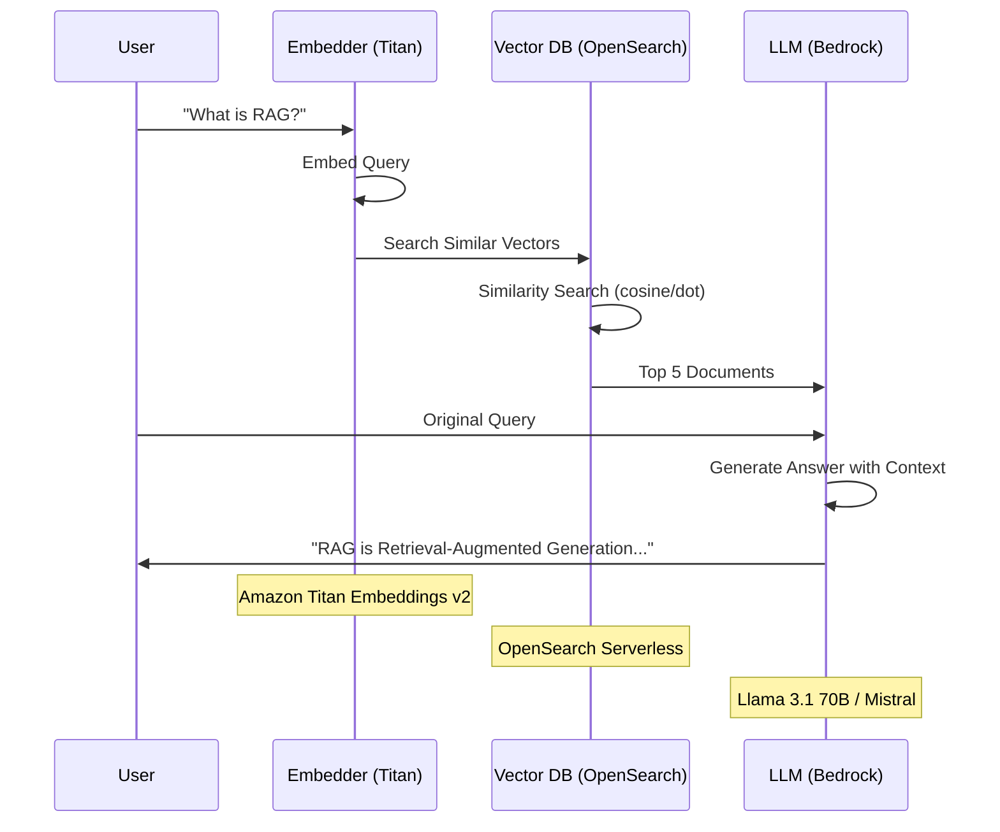
```mermaid
sequenceDiagram
    participant U as User
    participant E as Embedder (Titan)
    participant V as Vector DB (OpenSearch)
    participant L as LLM (Bedrock)
    
    U->>E: "What is RAG?"
    E->>E: Embed Query
    E->>V: Search Similar Vectors
    V->>V: Similarity Search (cosine/dot)
    V->>L: Top 5 Documents
    U->>L: Original Query
    L->>L: Generate Answer with Context
    L->>U: "RAG is Retrieval-Augmented Generation..."
    
    Note over E: Amazon Titan Embeddings v2
    Note over V: OpenSearch Serverless
    Note over L: Llama 3.1 70B / Mistral
```

**Notebook**: [01_Simple_RAG_AWS.ipynb](aws_notebooks/01_Simple_RAG_AWS.ipynb)

---

## 2. Simple RAG (#1)

### Architecture

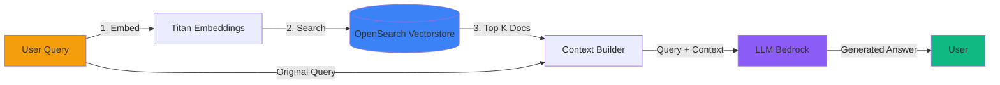
```mermaid
graph LR
    A[User Query] -->|1. Embed| B[Titan Embeddings]
    B -->|2. Search| C[(OpenSearch Vectorstore)]
    C -->|3. Top K Docs| D[Context Builder]
    A -->|Original Query| D
    D -->|Query + Context| E[LLM Bedrock]
    E -->|Generated Answer| F[User]
    
    style A fill:#f59e0b
    style C fill:#3b82f6
    style E fill:#8b5cf6
    style F fill:#10b981
```

### Data Flow

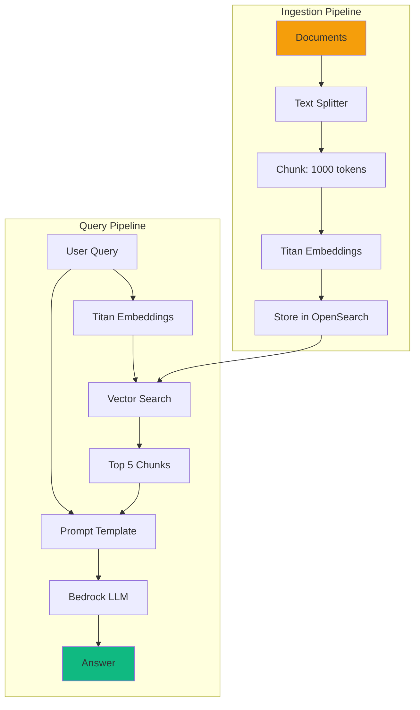
```mermaid
flowchart TD
    subgraph "Ingestion Pipeline"
        A[Documents] --> B[Text Splitter]
        B --> C[Chunk: 1000 tokens]
        C --> D[Titan Embeddings]
        D --> E[Store in OpenSearch]
    end
    
    subgraph "Query Pipeline"
        F[User Query] --> G[Titan Embeddings]
        G --> H[Vector Search]
        E --> H
        H --> I[Top 5 Chunks]
        I --> J[Prompt Template]
        F --> J
        J --> K[Bedrock LLM]
        K --> L[Answer]
    end
    
    style A fill:#f59e0b
    style L fill:#10b981
```

**Cost**: $0.08 per query  
**Best For**: Simple Q&A, baseline implementation  
**Notebook**: [01_Simple_RAG_AWS.ipynb](aws_notebooks/01_Simple_RAG_AWS.ipynb)

---

## 3. Graph RAG (#2)

### Architecture

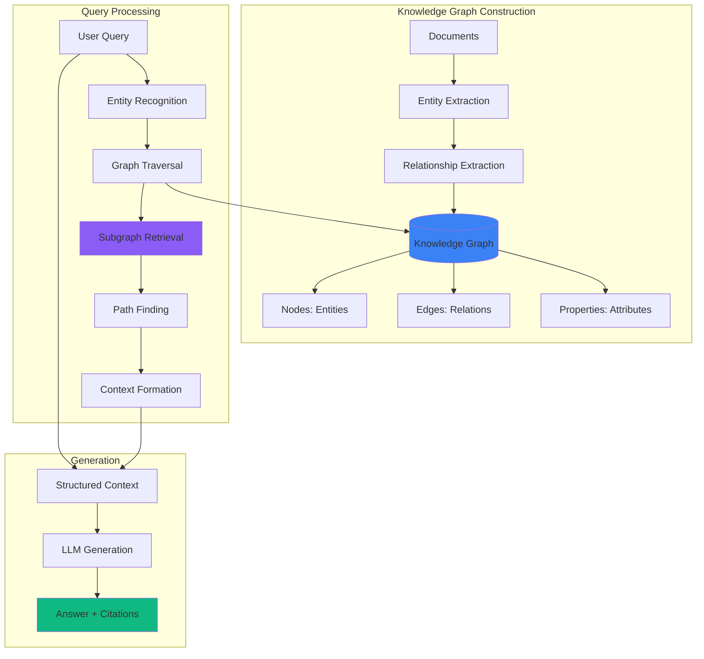
```mermaid
graph TB
    subgraph "Knowledge Graph Construction"
        A[Documents] --> B[Entity Extraction]
        B --> C[Relationship Extraction]
        C --> D[(Knowledge Graph)]
        
        D --> E[Nodes: Entities]
        D --> F[Edges: Relations]
        D --> G[Properties: Attributes]
    end
    
    subgraph "Query Processing"
        H[User Query] --> I[Entity Recognition]
        I --> J[Graph Traversal]
        J --> D
        J --> K[Subgraph Retrieval]
        K --> L[Path Finding]
        L --> M[Context Formation]
    end
    
    subgraph "Generation"
        M --> N[Structured Context]
        H --> N
        N --> O[LLM Generation]
        O --> P[Answer + Citations]
    end
    
    style D fill:#3b82f6
    style K fill:#8b5cf6
    style P fill:#10b981
```

### Knowledge Graph Structure

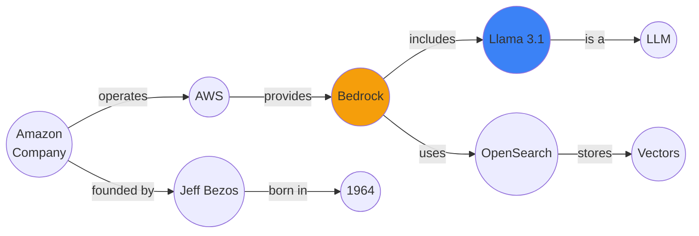
```mermaid
graph LR
    A((Amazon<br/>Company)) -->|operates| B((AWS))
    B -->|provides| C((Bedrock))
    C -->|includes| D((Llama 3.1))
    D -->|is a| E((LLM))
    
    A -->|founded by| F((Jeff Bezos))
    F -->|born in| G((1964))
    
    C -->|uses| H((OpenSearch))
    H -->|stores| I((Vectors))
    
    style C fill:#f59e0b
    style D fill:#3b82f6
```

**Cost**: $0.12 per query  
**Best For**: Complex entity relationships, knowledge-intensive domains  
**Notebook**: [02_Graph_RAG_AWS.ipynb](aws_notebooks/02_Graph_RAG_AWS.ipynb)

---

## 4. Agentic RAG (#12)

### Agent Decision Loop

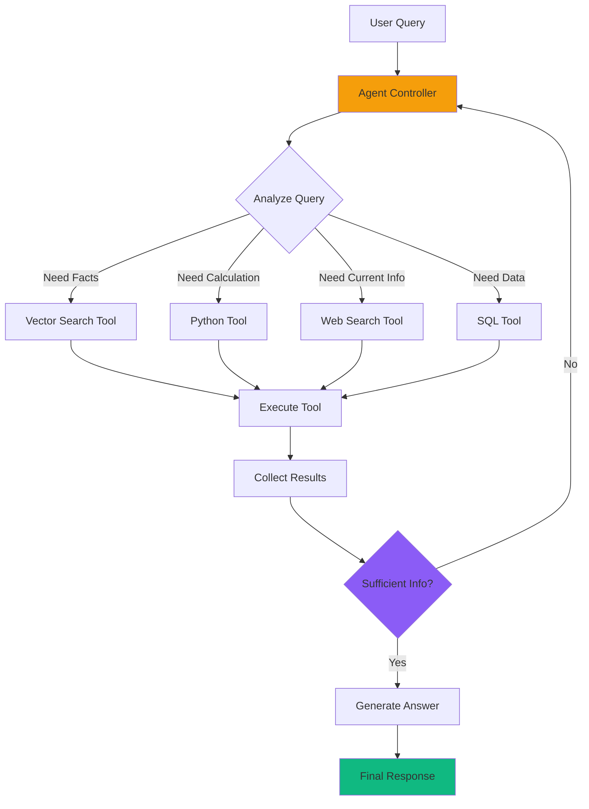
```mermaid
flowchart TD
    A[User Query] --> B[Agent Controller]
    B --> C{Analyze Query}
    
    C -->|Need Facts| D[Vector Search Tool]
    C -->|Need Calculation| E[Python Tool]
    C -->|Need Current Info| F[Web Search Tool]
    C -->|Need Data| G[SQL Tool]
    
    D --> H[Execute Tool]
    E --> H
    F --> H
    G --> H
    
    H --> I[Collect Results]
    I --> J{Sufficient Info?}
    
    J -->|No| B
    J -->|Yes| K[Generate Answer]
    K --> L[Final Response]
    
    style B fill:#f59e0b
    style J fill:#8b5cf6
    style L fill:#10b981
```

### Tool Selection Process

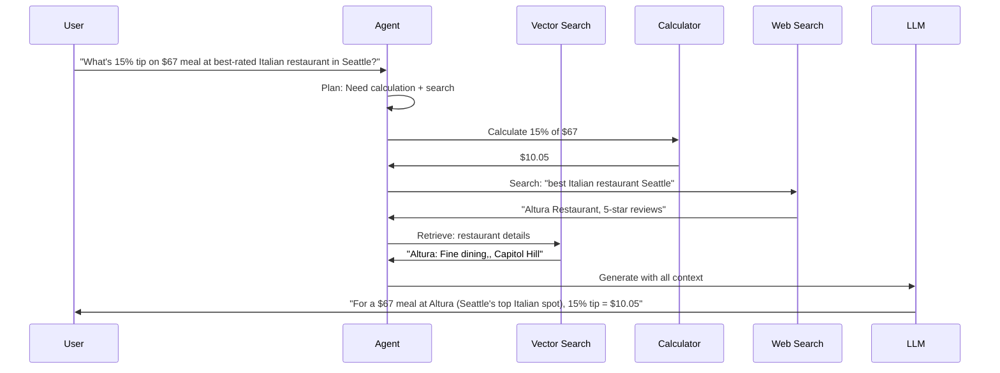
```mermaid
sequenceDiagram
    participant U as User
    participant A as Agent
    participant T1 as Vector Search
    participant T2 as Calculator
    participant T3 as Web Search
    participant L as LLM
    
    U->>A: "What's 15% tip on $67 meal at best-rated Italian restaurant in Seattle?"
    
    A->>A: Plan: Need calculation + search
    
    A->>T2: Calculate 15% of $67
    T2->>A: $10.05
    
    A->>T3: Search: "best Italian restaurant Seattle"
    T3->>A: "Altura Restaurant, 5-star reviews"
    
    A->>T1: Retrieve: restaurant details
    T1->>A: "Altura: Fine dining, $$$$, Capitol Hill"
    
    A->>L: Generate with all context
    L->>U: "For a $67 meal at Altura (Seattle's top Italian spot), 15% tip = $10.05"
```

**Cost**: $0.18 per query  
**Best For**: Complex multi-step reasoning, tool integration  
**Notebook**: [12_Agentic_RAG_AWS.ipynb](aws_notebooks/12_Agentic_RAG_AWS.ipynb)

---

## 5. Corrective RAG (CRAG) (#13)

### Three-Tier Strategy

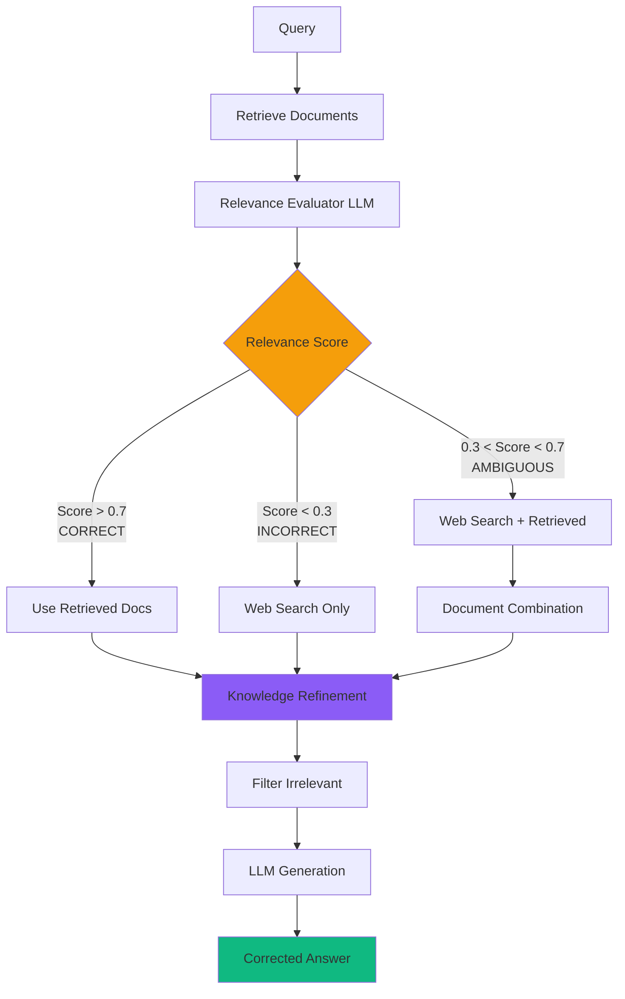
```mermaid
flowchart TD
    A[Query] --> B[Retrieve Documents]
    B --> C[Relevance Evaluator LLM]
    C --> D{Relevance Score}
    
    D -->|Score > 0.7<br/>CORRECT| E[Use Retrieved Docs]
    D -->|0.3 < Score < 0.7<br/>AMBIGUOUS| F[Web Search + Retrieved]
    D -->|Score < 0.3<br/>INCORRECT| G[Web Search Only]
    
    E --> H[Knowledge Refinement]
    F --> I[Document Combination]
    G --> H
    I --> H
    
    H --> J[Filter Irrelevant]
    J --> K[LLM Generation]
    K --> L[Corrected Answer]
    
    style D fill:#f59e0b
    style H fill:#8b5cf6
    style L fill:#10b981
```

### Correction Flow

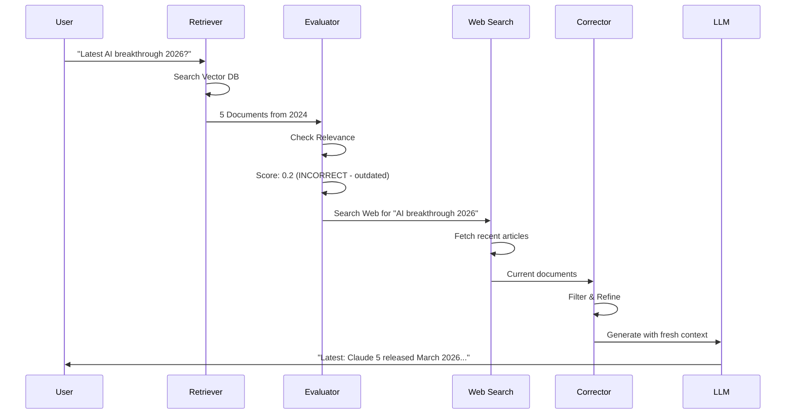
```mermaid
sequenceDiagram
    participant U as User
    participant R as Retriever
    participant E as Evaluator
    participant W as Web Search
    participant C as Corrector
    participant L as LLM
    
    U->>R: "Latest AI breakthrough 2026?"
    R->>R: Search Vector DB
    R->>E: 5 Documents from 2024
    E->>E: Check Relevance
    E->>E: Score: 0.2 (INCORRECT - outdated)
    
    E->>W: Search Web for "AI breakthrough 2026"
    W->>W: Fetch recent articles
    W->>C: Current documents
    
    C->>C: Filter & Refine
    C->>L: Generate with fresh context
    L->>U: "Latest: Claude 5 released March 2026..."
```

**Cost**: $0.15 per query  
**Best For**: Time-sensitive information, fact-checking  
**Notebook**: [13_Corrective_RAG_AWS.ipynb](aws_notebooks/13_Corrective_RAG_AWS.ipynb)

---

## 6. Self-RAG (#14)

### 4-Dimensional Quality Check

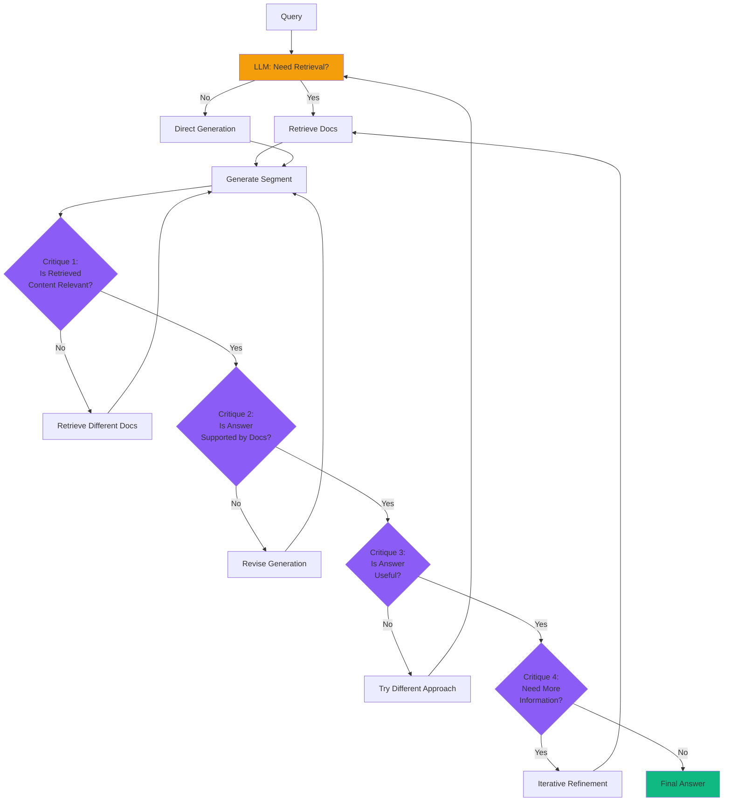
```mermaid
flowchart TD
    A[Query] --> B[LLM: Need Retrieval?]
    
    B -->|Yes| C[Retrieve Docs]
    B -->|No| D[Direct Generation]
    
    C --> E[Generate Segment]
    D --> E
    
    E --> F{Critique 1:<br/>Is Retrieved<br/>Content Relevant?}
    
    F -->|No| G[Retrieve Different Docs]
    F -->|Yes| H{Critique 2:<br/>Is Answer<br/>Supported by Docs?}
    
    G --> E
    
    H -->|No| I[Revise Generation]
    H -->|Yes| J{Critique 3:<br/>Is Answer<br/>Useful?}
    
    I --> E
    
    J -->|No| K[Try Different Approach]
    J -->|Yes| L{Critique 4:<br/>Need More<br/>Information?}
    
    K --> B
    
    L -->|Yes| M[Iterative Refinement]
    L -->|No| N[Final Answer]
    
    M --> C
    
    style B fill:#f59e0b
    style F fill:#8b5cf6
    style H fill:#8b5cf6
    style J fill:#8b5cf6
    style L fill:#8b5cf6
    style N fill:#10b981
```

### Self-Critique Process

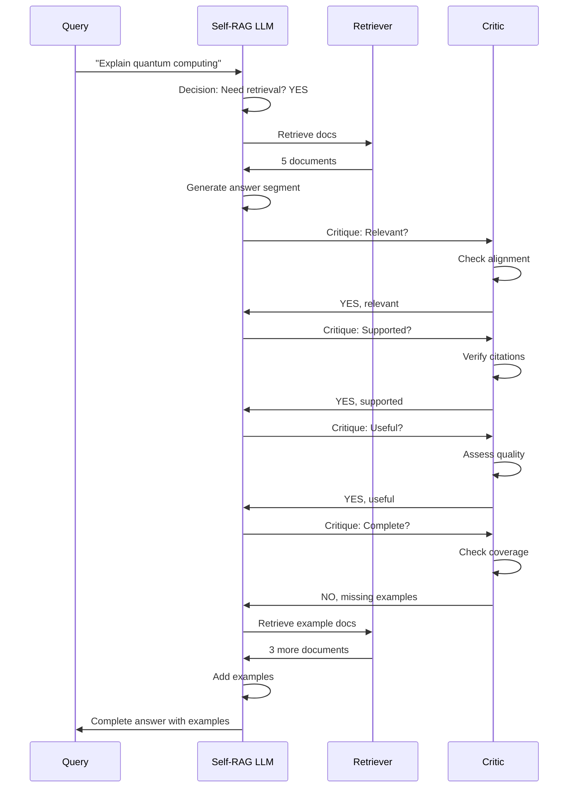
```mermaid
sequenceDiagram
    participant Q as Query
    participant LLM as Self-RAG LLM
    participant R as Retriever
    participant C as Critic
    
    Q->>LLM: "Explain quantum computing"
    LLM->>LLM: Decision: Need retrieval? YES
    
    LLM->>R: Retrieve docs
    R->>LLM: 5 documents
    
    LLM->>LLM: Generate answer segment
    LLM->>C: Critique: Relevant?
    C->>C: Check alignment
    C->>LLM: YES, relevant
    
    LLM->>C: Critique: Supported?
    C->>C: Verify citations
    C->>LLM: YES, supported
    
    LLM->>C: Critique: Useful?
    C->>C: Assess quality
    C->>LLM: YES, useful
    
    LLM->>C: Critique: Complete?
    C->>C: Check coverage
    C->>LLM: NO, missing examples
    
    LLM->>R: Retrieve example docs
    R->>LLM: 3 more documents
    LLM->>LLM: Add examples
    
    LLM->>Q: Complete answer with examples
```

**Cost**: $0.18 per query  
**Best For**: High-quality requirements, fact-sensitive domains  
**Notebook**: [14_Self_RAG_AWS.ipynb](aws_notebooks/14_Self_RAG_AWS.ipynb)

---

## 7. Memory Augmented RAG (#18)

### Conversation Memory Architecture

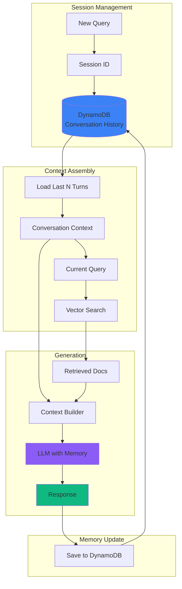
```mermaid
graph TB
    subgraph "Session Management"
        A[New Query] --> B[Session ID]
        B --> C[(DynamoDB<br/>Conversation History)]
    end
    
    subgraph "Context Assembly"
        C --> D[Load Last N Turns]
        D --> E[Conversation Context]
        E --> F[Current Query]
        F --> G[Vector Search]
    end
    
    subgraph "Generation"
        G --> H[Retrieved Docs]
        E --> I[Context Builder]
        H --> I
        I --> J[LLM with Memory]
        J --> K[Response]
    end
    
    subgraph "Memory Update"
        K --> L[Save to DynamoDB]
        L --> C
    end
    
    style C fill:#3b82f6
    style J fill:#8b5cf6
    style K fill:#10b981
```

### Multi-Turn Conversation Flow

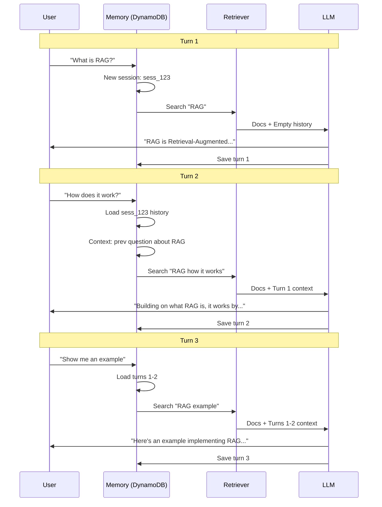
```mermaid
sequenceDiagram
    participant U as User
    participant M as Memory (DynamoDB)
    participant R as Retriever
    participant L as LLM
    
    Note over U,L: Turn 1
    U->>M: "What is RAG?"
    M->>M: New session: sess_123
    M->>R: Search "RAG"
    R->>L: Docs + Empty history
    L->>U: "RAG is Retrieval-Augmented..."
    L->>M: Save turn 1
    
    Note over U,L: Turn 2
    U->>M: "How does it work?"
    M->>M: Load sess_123 history
    M->>M: Context: prev question about RAG
    M->>R: Search "RAG how it works"
    R->>L: Docs + Turn 1 context
    L->>U: "Building on what RAG is, it works by..."
    L->>M: Save turn 2
    
    Note over U,L: Turn 3
    U->>M: "Show me an example"
    M->>M: Load turns 1-2
    M->>R: Search "RAG example"
    R->>L: Docs + Turns 1-2 context
    L->>U: "Here's an example implementing RAG..."
    L->>M: Save turn 3
```

**Cost**: $0.10 per query  
**Best For**: Chatbots, conversational AI, customer support  
**Notebook**: [18_Memory_Augmented_RAG_AWS.ipynb](aws_notebooks/18_Memory_Augmented_RAG_AWS.ipynb)

---

## 8. Hierarchical RAG (#22)

### Parent-Child Chunk Structure

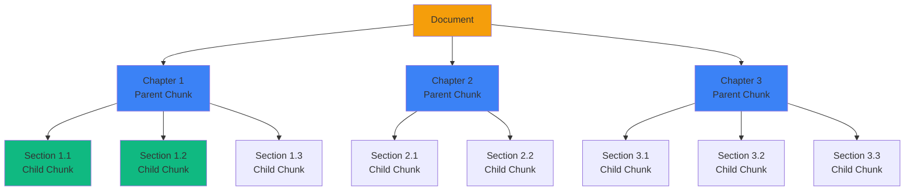
```mermaid
graph TD
    A[Document] --> B[Chapter 1<br/>Parent Chunk]
    A --> C[Chapter 2<br/>Parent Chunk]
    A --> D[Chapter 3<br/>Parent Chunk]
    
    B --> E[Section 1.1<br/>Child Chunk]
    B --> F[Section 1.2<br/>Child Chunk]
    B --> G[Section 1.3<br/>Child Chunk]
    
    C --> H[Section 2.1<br/>Child Chunk]
    C --> I[Section 2.2<br/>Child Chunk]
    
    D --> J[Section 3.1<br/>Child Chunk]
    D --> K[Section 3.2<br/>Child Chunk]
    D --> L[Section 3.3<br/>Child Chunk]
    
    style A fill:#f59e0b
    style B fill:#3b82f6
    style C fill:#3b82f6
    style D fill:#3b82f6
    style E fill:#10b981
    style F fill:#10b981
```

### Two-Stage Retrieval

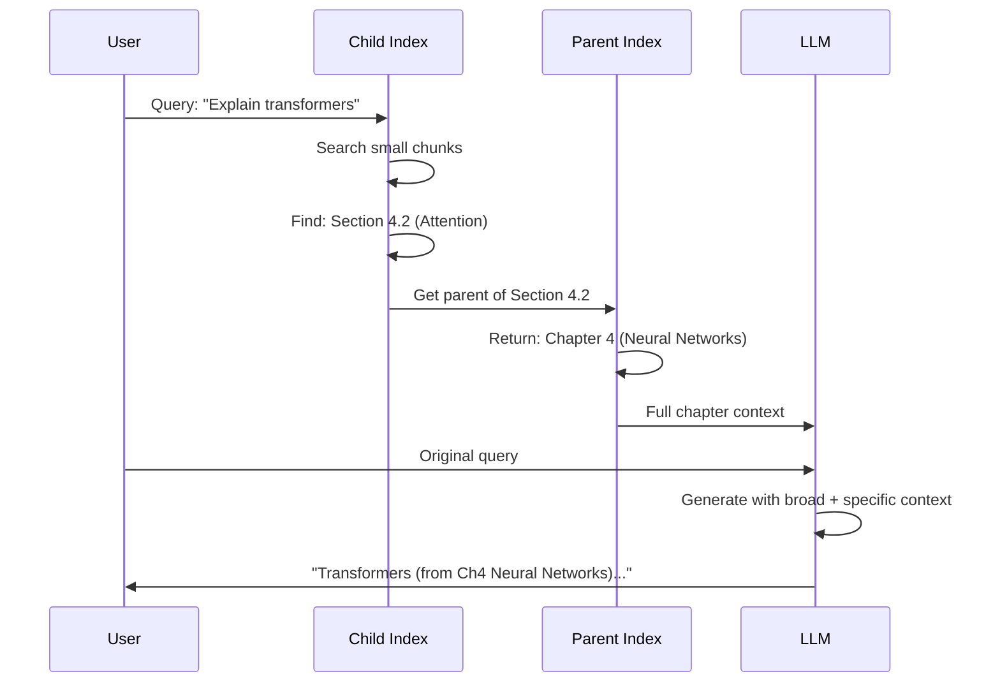
```mermaid
sequenceDiagram
    participant U as User
    participant V1 as Child Index
    participant V2 as Parent Index
    participant L as LLM
    
    U->>V1: Query: "Explain transformers"
    V1->>V1: Search small chunks
    V1->>V1: Find: Section 4.2 (Attention)
    
    V1->>V2: Get parent of Section 4.2
    V2->>V2: Return: Chapter 4 (Neural Networks)
    
    V2->>L: Full chapter context
    U->>L: Original query
    L->>L: Generate with broad + specific context
    L->>U: "Transformers (from Ch4 Neural Networks)..."
```

**Cost**: $0.11 per query  
**Best For**: Long documents, books, technical manuals  
**Notebook**: [22_Hierarchical_RAG_AWS.ipynb](aws_notebooks/22_Hierarchical_RAG_AWS.ipynb)

---

## 9. Production RAG System

### Complete Enterprise Architecture

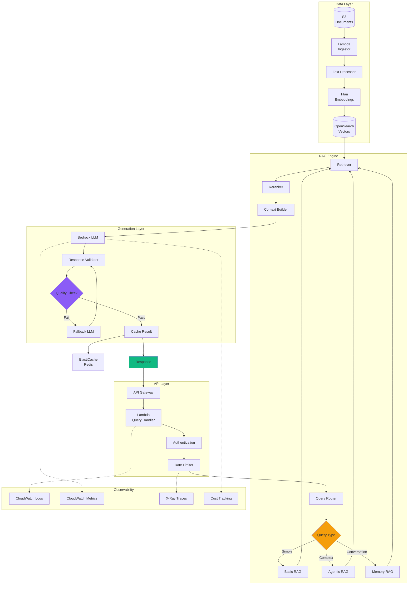
```mermaid
graph TB
    subgraph "Data Layer"
        A[(S3<br/>Documents)] --> B[Lambda<br/>Ingestor]
        B --> C[Text Processor]
        C --> D[Titan<br/>Embeddings]
        D --> E[(OpenSearch<br/>Vectors)]
    end
    
    subgraph "API Layer"
        F[API Gateway] --> G[Lambda<br/>Query Handler]
        G --> H[Authentication]
        H --> I[Rate Limiter]
    end
    
    subgraph "RAG Engine"
        I --> J[Query Router]
        J --> K{Query Type}
        K -->|Simple| L[Basic RAG]
        K -->|Complex| M[Agentic RAG]
        K -->|Conversation| N[Memory RAG]
        
        L --> O[Retriever]
        M --> O
        N --> O
        
        E --> O
        O --> P[Reranker]
        P --> Q[Context Builder]
    end
    
    subgraph "Generation Layer"
        Q --> R[Bedrock LLM]
        R --> S[Response Validator]
        S --> T{Quality Check}
        T -->|Pass| U[Cache Result]
        T -->|Fail| V[Fallback LLM]
        V --> S
    end
    
    subgraph "Observability"
        W[CloudWatch Logs]
        X[CloudWatch Metrics]
        Y[X-Ray Traces]
        Z[Cost Tracking]
        
        G -.-> W
        R -.-> X
        I -.-> Y
        R -.-> Z
    end
    
    U --> AA[ElastiCache<br/>Redis]
    U --> AB[Response]
    AB --> F
    
    style K fill:#f59e0b
    style T fill:#8b5cf6
    style AB fill:#10b981
```

### Error Handling & Fallbacks

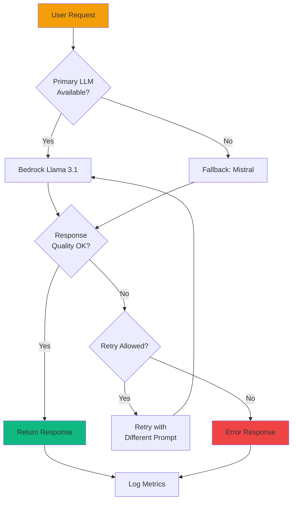
```mermaid
flowchart TD
    A[User Request] --> B{Primary LLM<br/>Available?}
    
    B -->|Yes| C[Bedrock Llama 3.1]
    B -->|No| D[Fallback: Mistral]
    
    C --> E{Response<br/>Quality OK?}
    D --> E
    
    E -->|Yes| F[Return Response]
    E -->|No| G{Retry Allowed?}
    
    G -->|Yes| H[Retry with<br/>Different Prompt]
    G -->|No| I[Error Response]
    
    H --> C
    
    F --> J[Log Metrics]
    I --> J
    
    style A fill:#f59e0b
    style F fill:#10b981
    style I fill:#ef4444
```

**Cost**: $0.10 per query + infrastructure  
**Best For**: Enterprise production systems  
**Notebook**: [35_Production_RAG_AWS.ipynb](aws_notebooks/35_Production_RAG_AWS.ipynb)

---

## 10. Pattern Selection Guide

### Decision Tree

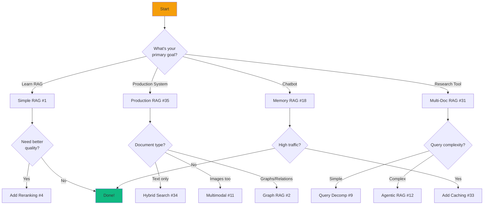
```mermaid
graph TD
    A[Start] --> B{What's your<br/>primary goal?}
    
    B -->|Learn RAG| C[Simple RAG #1]
    B -->|Production System| D[Production RAG #35]
    B -->|Research Tool| E[Multi-Doc RAG #31]
    B -->|Chatbot| F[Memory RAG #18]
    
    C --> G{Need better<br/>quality?}
    G -->|Yes| H[Add Reranking #4]
    G -->|No| I[Done!]
    
    F --> J{High traffic?}
    J -->|Yes| K[Add Caching #33]
    J -->|No| I
    
    D --> L{Document type?}
    L -->|Text only| M[Hybrid Search #34]
    L -->|Images too| N[Multimodal #11]
    L -->|Graphs/Relations| O[Graph RAG #2]
    
    E --> P{Query complexity?}
    P -->|Simple| Q[Query Decomp #9]
    P -->|Complex| R[Agentic RAG #12]
    
    style A fill:#f59e0b
    style I fill:#10b981
```

### By Use Case

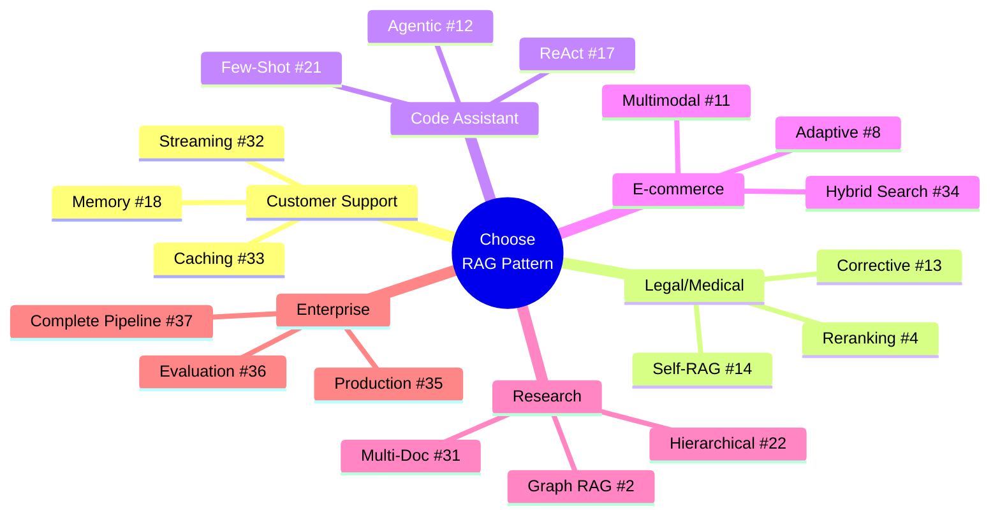
```mermaid
mindmap
  root((Choose<br/>RAG Pattern))
    Customer Support
      Memory #18
      Caching #33
      Streaming #32
    Legal/Medical
      Corrective #13
      Self-RAG #14
      Reranking #4
    Code Assistant
      Agentic #12
      ReAct #17
      Few-Shot #21
    E-commerce
      Hybrid Search #34
      Multimodal #11
      Adaptive #8
    Research
      Multi-Doc #31
      Graph RAG #2
      Hierarchical #22
    Enterprise
      Production #35
      Evaluation #36
      Complete Pipeline #37
```

### Performance vs Quality Trade-off

```mermaid
quadrantChart
    title RAG Pattern Positioning
    x-axis Low Cost --> High Cost
    y-axis Basic Quality --> Premium Quality
    quadrant-1 Premium (Worth It)
    quadrant-2 Over-engineered
    quadrant-3 Budget Choice
    quadrant-4 Best Value
    Simple RAG: [0.2, 0.3]
    Caching RAG: [0.1, 0.3]
    Adaptive RAG: [0.3, 0.5]
    Reranking: [0.4, 0.6]
    HyDE: [0.5, 0.6]
    Corrective RAG: [0.5, 0.7]
    Self-RAG: [0.6, 0.8]
    Agentic RAG: [0.7, 0.9]
    Tree of Thoughts: [0.9, 0.9]
    Multimodal: [0.8, 0.8]
```

---

## 📚 Pattern Comparison Matrix

| Pattern | Complexity | Quality | Speed | Cost | Best For |
|---------|-----------|---------|-------|------|----------|
| Simple RAG #1 | ⭐ | ⭐⭐⭐ | ⭐⭐⭐⭐⭐ | $ | Baseline |
| Graph RAG #2 | ⭐⭐⭐⭐ | ⭐⭐⭐⭐⭐ | ⭐⭐⭐ | $$ | Entities |
| Fusion #3 | ⭐⭐ | ⭐⭐⭐⭐ | ⭐⭐⭐ | $$ | Multi-query |
| Reranking #4 | ⭐⭐ | ⭐⭐⭐⭐⭐ | ⭐⭐⭐ | $$ | Quality |
| HyDE #5 | ⭐⭐⭐ | ⭐⭐⭐⭐ | ⭐⭐ | $$$ | Semantic gap |
| Adaptive #8 | ⭐⭐⭐ | ⭐⭐⭐⭐ | ⭐⭐⭐⭐ | $-$$$ | Cost optimal |
| Agentic #12 | ⭐⭐⭐⭐⭐ | ⭐⭐⭐⭐⭐ | ⭐⭐ | $$$ | Complex tasks |
| Corrective #13 | ⭐⭐⭐⭐ | ⭐⭐⭐⭐⭐ | ⭐⭐ | $$$ | Accuracy |
| Self-RAG #14 | ⭐⭐⭐⭐⭐ | ⭐⭐⭐⭐⭐ | ⭐⭐ | $$$ | Quality gates |
| Memory #18 | ⭐⭐ | ⭐⭐⭐⭐ | ⭐⭐⭐⭐ | $$ | Chatbots |
| Hierarchical #22 | ⭐⭐⭐ | ⭐⭐⭐⭐ | ⭐⭐⭐ | $$ | Long docs |
| Caching #33 | ⭐⭐ | ⭐⭐⭐ | ⭐⭐⭐⭐⭐ | $ | Performance |
| Hybrid Search #34 | ⭐⭐⭐ | ⭐⭐⭐⭐⭐ | ⭐⭐⭐ | $$ | Best recall |
| Production #35 | ⭐⭐⭐⭐⭐ | ⭐⭐⭐⭐⭐ | ⭐⭐⭐ | $$$ | Enterprise |

---

## 🔗 Quick Links

- **GitHub Repository**: https://github.com/Ramu-DE/rag_pattern_notebooks
- **Main README**: [README.md](README.md)
- **Architecture Doc**: [ARCHITECTURE.md](ARCHITECTURE.md)
- **AWS Setup**: [AWS_SETUP_SUMMARY.md](AWS_SETUP_SUMMARY.md)
- **Pattern List**: [ALL_37_PATTERNS.md](ALL_37_PATTERNS.md)

---

**📖 Read the patterns. ⚡ Execute the notebooks. 🚀 Build production RAG!**

*Last Updated: 2026-07-05*
