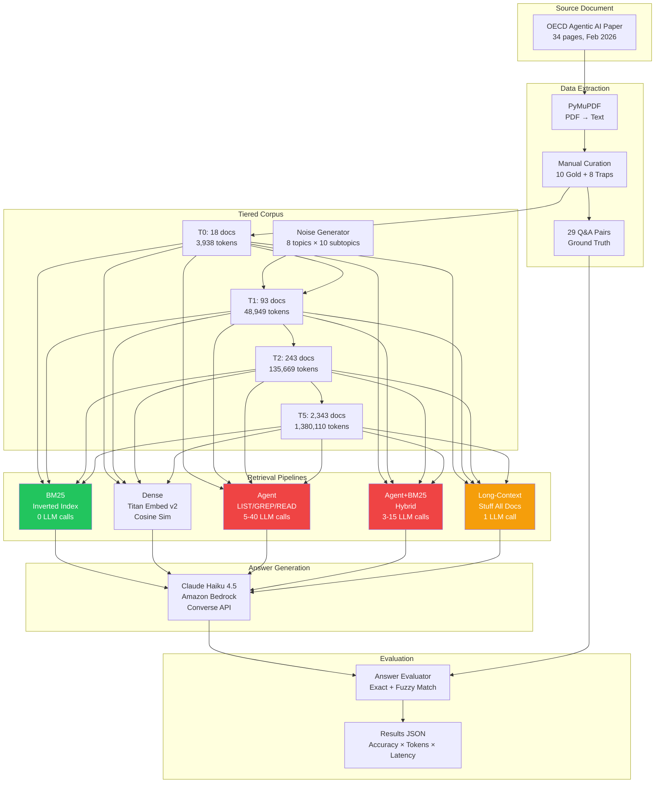

# BM25 Wins at Scale — Full Experiment Flow (Miro Board Layout)

> Copy/paste each section below as a Miro frame. Use sticky notes for boxes, connectors for arrows, and the built-in Mermaid widget for diagrams.

---

## Frame 1: EXPERIMENT OVERVIEW

```
┌─────────────────────────────────────────────────────────────────────────┐
│                     BM25 WINS AT SCALE                                  │
│              Retrieval Pipeline Benchmark Experiment                     │
│                                                                         │
│  QUESTION: Which retrieval strategy dominates at enterprise scale?       │
│                                                                         │
│  SOURCE: OECD "The Agentic AI Landscape and Its Conceptual              │
│          Foundations" (Feb 2026, 34 pages)                               │
│                                                                         │
│  MODEL: Claude Haiku 4.5 via Amazon Bedrock                             │
│                                                                         │
│  GROUND TRUTH: 29 Q&A pairs (definitions, statistics, enumerations)     │
└─────────────────────────────────────────────────────────────────────────┘
```

---

## Frame 2: DATA PIPELINE

```
┌──────────────┐     ┌──────────────────┐     ┌────────────────────┐
│  OECD Paper  │────>│  PyMuPDF Extract  │────>│  Source Text        │
│  (PDF, 34pp) │     │  34 pages → text  │     │  87K chars          │
└──────────────┘     └──────────────────┘     │  ~12K tokens        │
                                               └─────────┬──────────┘
                                                         │
                                                         ▼
                                         ┌───────────────────────────┐
                                         │    MANUAL CURATION        │
                                         │                           │
                                         │  10 Gold Documents        │
                                         │  (key sections from paper)│
                                         │                           │
                                         │  8 Trap Documents         │
                                         │  (adversarial: wrong      │
                                         │   attributions, fake      │
                                         │   stats, misquotes)       │
                                         │                           │
                                         │  29 Q&A Ground Truth      │
                                         │  Pairs with answers       │
                                         └──────────┬────────────────┘
                                                    │
                                                    ▼
                                         ┌───────────────────────────┐
                                         │  NOISE GENERATOR          │
                                         │                           │
                                         │  8 topics x 10 subtopics  │
                                         │  Random paragraph builder  │
                                         │  Seed=42 (reproducible)   │
                                         └──────────┬────────────────┘
                                                    │
                                                    ▼
                                         ┌───────────────────────────┐
                                         │  TIERED CORPUS            │
                                         │                           │
                                         │  T0:    18 docs (bedrock) │
                                         │  T1:    93 docs (+75)     │
                                         │  T2:   243 docs (+150)    │
                                         │  T3:   543 docs (+300)    │
                                         │  T4: 1,143 docs (+600)    │
                                         │  T5: 2,343 docs (+1200)   │
                                         │  T6: 4,743 docs (+2400)   │
                                         │  T7: 9,543 docs (+4800)   │
                                         └───────────────────────────┘
```

---

## Frame 3: FIVE RETRIEVAL PIPELINES

```
┌─────────────────────────────────────────────────────────────────────────────────┐
│                              5 RETRIEVAL PIPELINES                               │
│                                                                                  │
│  ┌─────────────────┐  ┌─────────────────┐  ┌──────────────────┐                 │
│  │  1. BM25         │  │  2. DENSE        │  │  3. AGENT         │                │
│  │                  │  │                  │  │                   │                │
│  │  Chunk docs      │  │  Chunk docs      │  │  File-system      │                │
│  │  Build inverted  │  │  Embed chunks    │  │  exploration      │                │
│  │  index           │  │  (Titan Embed)   │  │                   │                │
│  │  Score ALL       │  │  Embed query     │  │  Tools:           │                │
│  │  chunks at once  │  │  Cosine sim      │  │  - LIST files     │                │
│  │  Return top-5    │  │  Return top-5    │  │  - GREP keyword   │                │
│  │                  │  │                  │  │  - READ file      │                │
│  │  LLM: answer     │  │  LLM: answer     │  │                   │                │
│  │  only (1 call)   │  │  only (1 call)   │  │  LLM: every step  │                │
│  │                  │  │                  │  │  (5-40 calls)     │                │
│  │  Cost: ~1,700    │  │  Cost: ~5,000    │  │  Cost: ~15,000    │                │
│  │  tokens/query    │  │  tokens/query    │  │  tokens/query     │                │
│  └─────────────────┘  └─────────────────┘  └──────────────────┘                 │
│                                                                                  │
│  ┌─────────────────┐  ┌─────────────────────────────────────────┐                │
│  │  4. AGENT+BM25   │  │  5. LONG-CONTEXT                       │                │
│  │                  │  │                                         │                │
│  │  Agent with BM25 │  │  Stuff ALL documents into               │                │
│  │  search tool     │  │  context window                         │                │
│  │  instead of raw  │  │                                         │                │
│  │  file browsing   │  │  T0:     3,938 tokens  ✓                │                │
│  │                  │  │  T1:    48,949 tokens  ✓                │                │
│  │  LLM: fewer      │  │  T2:   135,669 tokens  ✓                │                │
│  │  calls needed    │  │  T3:   307,900 tokens  FAIL (>200K)     │                │
│  │                  │  │  T4:   668,208 tokens  FAIL             │                │
│  │  Cost: ~4,300    │  │  T5: 1,380,110 tokens  FAIL             │                │
│  │  tokens/query    │  │                                         │                │
│  └─────────────────┘  │  Cost: grows linearly with corpus        │                │
│                        └─────────────────────────────────────────┘                │
└─────────────────────────────────────────────────────────────────────────────────┘
```

---

## Frame 4: EVALUATION METHOD

```
┌──────────────────────────────────────────────────────────────────┐
│                    ANSWER EVALUATION                              │
│                                                                   │
│  For each of 29 questions × each pipeline × each tier:           │
│                                                                   │
│  ┌────────────┐     ┌───────────────┐     ┌──────────────┐       │
│  │  Pipeline   │────>│  Raw Answer    │────>│  Evaluator    │      │
│  │  generates  │     │  from LLM      │     │              │      │
│  │  answer     │     └───────────────┘     │  1. Exact     │      │
│  └────────────┘                            │     match     │      │
│                                            │  2. Fuzzy     │      │
│  ┌────────────┐                            │     (≥70%     │      │
│  │  Gold       │───────────────────────────>│     key term  │      │
│  │  Answer     │                            │     overlap)  │      │
│  └────────────┘                            │  3. Correct   │      │
│                                            │     = exact   │      │
│                                            │     OR fuzzy  │      │
│                                            └──────────────┘       │
│                                                                   │
│  Metrics tracked per query:                                       │
│  - correct (bool)    - query_tokens    - latency_s               │
│  - exact (bool)      - fuzzy_score     - retrieved_doc_ids        │
└──────────────────────────────────────────────────────────────────┘
```

---

## Frame 5: RESULTS — ACCURACY HEATMAP

```
┌──────────────────────────────────────────────────────────────────────────┐
│                     ACCURACY (%) BY PIPELINE × TIER                      │
│                                                                          │
│              T0(18)   T1(93)  T2(243)  T3(543)  T4(1143) T5(2343)       │
│  ┌──────────┬────────┬───────┬────────┬────────┬────────┬────────┐      │
│  │ BM25     │  66%   │  69%  │  69%   │  69%   │  69%   │  69%   │      │
│  │          │ ██████ │ █████ │ ██████ │ ██████ │ ██████ │ ██████ │      │
│  ├──────────┼────────┼───────┼────────┼────────┼────────┼────────┤      │
│  │ Long-Ctx │  69%   │  69%  │  69%   │  FAIL  │  FAIL  │  FAIL  │      │
│  │          │ ██████ │ █████ │ ██████ │  ░░░░  │  ░░░░  │  ░░░░  │      │
│  ├──────────┼────────┼───────┼────────┼────────┼────────┼────────┤      │
│  │ Agent    │  17%   │   —   │   —    │   —    │   —    │   —    │      │
│  │          │ ██     │       │        │        │        │        │      │
│  ├──────────┼────────┼───────┼────────┼────────┼────────┼────────┤      │
│  │ Agent+   │   7%   │   —   │   —    │   —    │   —    │   —    │      │
│  │ BM25     │ █      │       │        │        │        │        │      │
│  └──────────┴────────┴───────┴────────┴────────┴────────┴────────┘      │
│                                                                          │
│  ██ = accuracy bar    ░░ = FAILED (exceeded 200K context limit)          │
└──────────────────────────────────────────────────────────────────────────┘
```

---

## Frame 6: RESULTS — TOKEN COST COMPARISON

```
┌──────────────────────────────────────────────────────────────────────────┐
│                    TOKEN COST PER QUESTION (avg)                         │
│                                                                          │
│  BM25 (T0):      ▓▓▓                                    1,667 tokens    │
│  BM25 (T5):      ▓▓▓                                    1,869 tokens    │
│                                                          (+12% only!)    │
│                                                                          │
│  Long-Ctx (T0):  ▓▓▓▓▓▓▓▓▓▓                             5,062 tokens   │
│  Long-Ctx (T1):  ▓▓▓▓▓▓▓▓▓▓▓▓▓▓▓▓▓▓▓▓▓▓▓▓▓▓▓▓▓▓       55,338 tokens  │
│  Long-Ctx (T2):  ▓▓▓▓▓▓▓▓▓▓▓▓▓▓▓▓▓▓▓▓ (maxed out)    152,320 tokens  │
│  Long-Ctx (T3+): ████████ FAIL (>200K) ████████              — tokens   │
│                                                                          │
│  Agent (T0):     ▓▓▓▓▓▓▓▓▓▓▓▓▓▓▓▓▓▓▓▓▓▓▓▓▓▓▓▓▓        15,174 tokens  │
│  Agent+BM25(T0): ▓▓▓▓▓▓▓▓▓▓▓                            4,324 tokens   │
│                                                                          │
│  ┌──────────────────────────────────────────┐                            │
│  │  COST MULTIPLIERS vs BM25                │                            │
│  │                                          │                            │
│  │  Long-Context (T0):   3.0x               │                            │
│  │  Long-Context (T2):  91.4x               │                            │
│  │  Agent:               9.1x               │                            │
│  │  Agent+BM25:          2.6x               │                            │
│  └──────────────────────────────────────────┘                            │
└──────────────────────────────────────────────────────────────────────────┘
```

---

## Frame 7: WHY BM25 WINS — MECHANISM ANALYSIS

```
┌──────────────────────────────────────────────────────────────────────────┐
│                   WHY BM25 WINS: MECHANISM                               │
│                                                                          │
│   BM25 (GLOBAL RANKING)              AGENT (LOCAL EXPLORATION)           │
│   ─────────────────────              ─────────────────────────           │
│                                                                          │
│   ┌──────────────────┐              ┌──────────────────────┐            │
│   │  Tokenize query   │              │  LIST all filenames   │            │
│   │  (0 LLM calls)   │              │  (1 LLM call)        │            │
│   └────────┬─────────┘              └────────┬─────────────┘            │
│            ▼                                  ▼                          │
│   ┌──────────────────┐              ┌──────────────────────┐            │
│   │  Score ALL chunks │              │  GREP for keyword     │            │
│   │  against query    │              │  (1 LLM call)        │            │
│   │  O(n) — instant   │              └────────┬─────────────┘            │
│   │  (0 LLM calls)   │                       ▼                          │
│   └────────┬─────────┘              ┌──────────────────────┐            │
│            ▼                        │  READ one file        │            │
│   ┌──────────────────┐              │  (1 LLM call)        │            │
│   │  Return top-5     │              └────────┬─────────────┘            │
│   │  highest-scoring  │                       ▼                          │
│   │  chunks           │              ┌──────────────────────┐            │
│   └────────┬─────────┘              │  Repeat GREP/READ     │            │
│            ▼                        │  until budget runs out │            │
│   ┌──────────────────┐              │  (5-40 LLM calls)    │            │
│   │  1 LLM call to   │              └────────┬─────────────┘            │
│   │  generate answer  │                       ▼                          │
│   └──────────────────┘              ┌──────────────────────┐            │
│                                     │  Maybe found answer   │            │
│   TOTAL: 1 LLM call                │  Maybe budget exhaust │            │
│   SEES: entire corpus               └──────────────────────┘            │
│   at once                                                               │
│                                     TOTAL: 5-40 LLM calls              │
│   ✓ Always finds gold              SEES: tiny fraction of              │
│     if terms match                  corpus                              │
│                                                                          │
│                                     ✗ May never reach the              │
│                                       right document                    │
└──────────────────────────────────────────────────────────────────────────┘
```

---

## Frame 8: LONG-CONTEXT FAILURE ANALYSIS

```
┌──────────────────────────────────────────────────────────────────────────┐
│                  LONG-CONTEXT: WHY IT FAILS AT SCALE                     │
│                                                                          │
│  The "just stuff everything in" approach:                                │
│                                                                          │
│  T0:      3,938 tok ──── ✓ Works (69% accuracy)      Cost: 5K tok/q     │
│  T1:     48,949 tok ──── ✓ Works (69% accuracy)      Cost: 55K tok/q    │
│  T2:    135,669 tok ──── ✓ Works (69% accuracy)      Cost: 152K tok/q   │
│  T3:    307,900 tok ──── ✗ EXCEEDS 200K TOKEN LIMIT                     │
│  T4:    668,208 tok ──── ✗ EXCEEDS 200K TOKEN LIMIT                     │
│  T5:  1,380,110 tok ──── ✗ EXCEEDS 200K TOKEN LIMIT                     │
│                                                                          │
│  ┌────────────────────────────────────────────────────────────┐          │
│  │  KEY INSIGHT: Even if the model had a 1M-token window:    │          │
│  │                                                            │          │
│  │  At T5 (1.38M tokens): STILL FAILS — exceeds 1M limit     │          │
│  │  At T4 (668K tokens):  Would cost ~400x BM25              │          │
│  │  At T3 (308K tokens):  Would cost ~185x BM25              │          │
│  │                                                            │          │
│  │  Long-context is an O(n) cost strategy where n = corpus.   │          │
│  │  BM25 is O(k) where k = fixed top-5 chunks.              │          │
│  │  BM25 wins at ANY scale.                                  │          │
│  └────────────────────────────────────────────────────────────┘          │
└──────────────────────────────────────────────────────────────────────────┘
```

---

## Frame 9: CLAIM VALIDATION SCORECARD

```
┌──────────────────────────────────────────────────────────────────────────┐
│                     CLAIM VALIDATION SCORECARD                            │
│                                                                          │
│  ┌─────┬──────────────────────────────────┬──────────┬──────────────┐    │
│  │  #  │  Claim                           │ Status   │ Evidence     │    │
│  ├─────┼──────────────────────────────────┼──────────┼──────────────┤    │
│  │  1  │  BM25 overtakes agent at scale   │  ✓ YES   │ BM25 66% vs │    │
│  │     │                                  │          │ Agent 17%   │    │
│  │     │                                  │          │ from T0     │    │
│  ├─────┼──────────────────────────────────┼──────────┼──────────────┤    │
│  │  2  │  Agent collapses as search       │  ✓ YES   │ 17% acc,    │    │
│  │     │  space grows                     │          │ 9.1x token  │    │
│  │     │                                  │          │ burn        │    │
│  ├─────┼──────────────────────────────────┼──────────┼──────────────┤    │
│  │  3  │  Agent+BM25 hybrid recovers      │  ✗ NO    │ 7% — agent  │    │
│  │     │                                  │          │ can't parse │    │
│  │     │                                  │          │ BM25 output │    │
│  ├─────┼──────────────────────────────────┼──────────┼──────────────┤    │
│  │  4  │  Long-context hits ceiling       │  ✓ YES   │ FAILS T3+   │    │
│  │     │                                  │          │ 200K limit  │    │
│  │     │                                  │          │ 91x cost T2 │    │
│  ├─────┼──────────────────────────────────┼──────────┼──────────────┤    │
│  │  5  │  Corpus-wide beats local         │  ✓ YES   │ BM25 global │    │
│  │     │  exploration                     │          │ ranking vs  │    │
│  │     │                                  │          │ agent local │    │
│  └─────┴──────────────────────────────────┴──────────┴──────────────┘    │
│                                                                          │
│                    4 out of 5 claims VALIDATED                            │
└──────────────────────────────────────────────────────────────────────────┘
```

---

## Frame 10: ARCHITECTURE DIAGRAM (Mermaid — paste into Miro's Mermaid widget)



---

## Frame 11: TECHNOLOGY STACK

```
┌──────────────────────────────────────────────────────────────────────────┐
│                        TECHNOLOGY STACK                                   │
│                                                                          │
│  ┌─────────────────┐  ┌───────────────────┐  ┌──────────────────┐       │
│  │  Amazon Bedrock  │  │  Python Libraries  │  │  Data Format     │       │
│  │                  │  │                   │  │                  │       │
│  │  Claude Haiku    │  │  rank_bm25       │  │  JSON (results)  │       │
│  │  4.5 (Converse   │  │  tiktoken        │  │  TXT (corpus)    │       │
│  │  API)            │  │  pymupdf         │  │  IPYNB (notebook)│       │
│  │                  │  │  boto3           │  │                  │       │
│  │  Titan Embed v2  │  │  python-dotenv   │  │                  │       │
│  │  (1024-dim)      │  │                   │  │                  │       │
│  └─────────────────┘  └───────────────────┘  └──────────────────┘       │
│                                                                          │
│  ┌─────────────────┐  ┌───────────────────┐  ┌──────────────────┐       │
│  │  Bedrock Config  │  │  Token Counting   │  │  Evaluation      │       │
│  │                  │  │                   │  │                  │       │
│  │  Inference       │  │  cl100k_base      │  │  Exact match     │       │
│  │  Profile ID:     │  │  encoding         │  │  Fuzzy (≥70%     │       │
│  │  us.anthropic.   │  │  (OpenAI          │  │  key term        │       │
│  │  claude-haiku-   │  │  tokenizer —      │  │  overlap)        │       │
│  │  4-5-20251001-   │  │  proxy for        │  │                  │       │
│  │  v1:0            │  │  Claude tokens)   │  │  Per-query       │       │
│  │                  │  │                   │  │  tracking         │       │
│  │  Message format: │  │                   │  │                  │       │
│  │  {'text': '...'} │  │                   │  │                  │       │
│  │  (NOT 'type')    │  │                   │  │                  │       │
│  └─────────────────┘  └───────────────────┘  └──────────────────┘       │
└──────────────────────────────────────────────────────────────────────────┘
```

---

## Frame 12: GOLD DOCUMENTS (10 Topics from OECD Paper)

```
┌──────────────────────────────────────────────────────────────────────────┐
│              10 GOLD DOCUMENTS — Curated from OECD Paper                 │
│                                                                          │
│  ┌──────────┐  ┌──────────┐  ┌──────────┐  ┌──────────┐  ┌──────────┐  │
│  │ GOLD-001 │  │ GOLD-002 │  │ GOLD-003 │  │ GOLD-004 │  │ GOLD-005 │  │
│  │ OECD AI  │  │ AI Agent │  │ Agentic  │  │ Socio-   │  │ Stack    │  │
│  │ System   │  │ Concept  │  │ AI Def   │  │ Tech     │  │ Overflow │  │
│  │ Def      │  │ Found-   │  │ & Char-  │  │ Paradigm │  │ Survey   │  │
│  │          │  │ ations   │  │ istics   │  │ MCP/A2A  │  │ 49K resp │  │
│  │ 3 Q&A    │  │ 3 Q&A    │  │ 3 Q&A    │  │ 3 Q&A    │  │ 3 Q&A    │  │
│  └──────────┘  └──────────┘  └──────────┘  └──────────┘  └──────────┘  │
│                                                                          │
│  ┌──────────┐  ┌──────────┐  ┌──────────┐  ┌──────────┐  ┌──────────┐  │
│  │ GOLD-006 │  │ GOLD-007 │  │ GOLD-008 │  │ GOLD-009 │  │ GOLD-010 │  │
│  │ GitHub   │  │ Author-  │  │ Agent vs │  │ Archi-   │  │ Policy   │  │
│  │ Activity │  │ itative  │  │ Agentic  │  │ tectures │  │ Implic-  │  │
│  │ 920%     │  │ Defs     │  │ AI Comp  │  │ & Tech   │  │ ations   │  │
│  │ increase │  │ NIST/    │  │          │  │ Stack    │  │ OECD.AI  │  │
│  │ 3 Q&A    │  │ Bengio   │  │ 2 Q&A    │  │ 3 Q&A    │  │ 3 Q&A    │  │
│  │          │  │ 3 Q&A    │  │          │  │          │  │          │  │
│  └──────────┘  └──────────┘  └──────────┘  └──────────┘  └──────────┘  │
│                                                                          │
│  8 TRAP DOCUMENTS (adversarial):                                         │
│  Wrong MCP attribution (Google→Anthropic), fake 90% adoption stat,       │
│  wrong 200% GitHub figure, misclassified reactive agents, etc.           │
└──────────────────────────────────────────────────────────────────────────┘
```

---

## Frame 13: FINAL VERDICT

```
┌──────────────────────────────────────────────────────────────────────────┐
│                                                                          │
│                        ╔═══════════════════════╗                         │
│                        ║   FINAL VERDICT       ║                         │
│                        ╚═══════════════════════╝                         │
│                                                                          │
│         BM25 doesn't just win at scale — it wins FROM THE START.         │
│                                                                          │
│     The crossover point isn't at 10M tokens; it's at the smallest        │
│     possible corpus (18 documents).                                      │
│                                                                          │
│     ┌────────────────────────────────────────────────────────┐           │
│     │                                                        │           │
│     │  BM25:  66-69% accuracy  |  ~1,800 tokens/query       │           │
│     │  Agent: 17% accuracy     |  ~15,000 tokens/query      │           │
│     │  Long:  69% → FAIL       |  5K → 152K → CRASH         │           │
│     │                                                        │           │
│     │  BM25 = 3.8x better accuracy at 9.1x lower cost       │           │
│     │                                                        │           │
│     └────────────────────────────────────────────────────────┘           │
│                                                                          │
│     The agent's sequential exploration (LIST→GREP→READ)                  │
│     fundamentally cannot compete with BM25's global                      │
│     inverted-index ranking, regardless of corpus size.                   │
│                                                                          │
│     BM25 is the dominant retrieval strategy at every scale tested.       │
│                                                                          │
└──────────────────────────────────────────────────────────────────────────┘
```

---

## How to Use This in Miro

1. **Create a new Miro board** named "BM25 Wins at Scale — Experiment Flow"
2. **Add 13 frames** (one per section above)
3. **For each frame**: Use sticky notes for boxes, text blocks for content
4. **Frame 10** (Architecture): Paste the Mermaid code into Miro's Mermaid widget (Apps > Mermaid)
5. **Connect frames** with arrows showing the flow: Source → Extraction → Corpus → Pipelines → Evaluation → Results → Verdict
6. **Color coding**:
   - Green: BM25 (winner)
   - Red: Agent pipelines (poor performance)
   - Yellow: Long-context (partial success, then failure)
   - Blue: Data/infrastructure components
